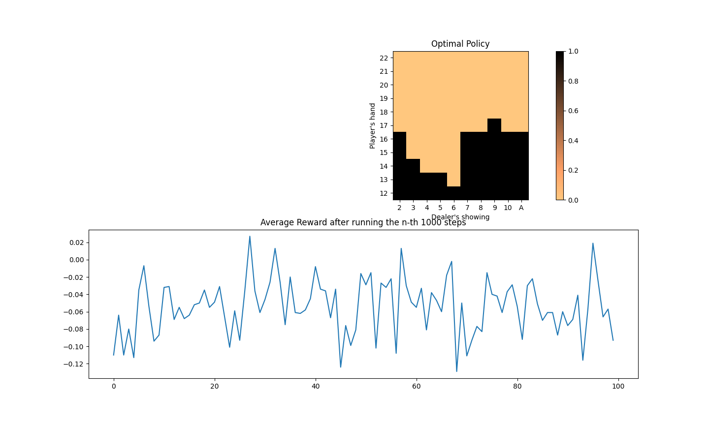

## BlackJack
Hi, this project simulates a classical Blackjack game and the final goal is to find the optimal strategy for this game.

### Modified Game Rule (compared with textbook):
* All face cards count as 10, and Ace count as 11
* Dealer always hits at 16 or lower; otherwise sticks
* The the goal is to get as close as possible to (but not over) 22

### Install
* $ pip install numpy
* $ pip install matplotlib
* $ pip install random

### How to run
$ python BlackJack.py

By running the code it gonna print the averaged reward after each 1000 training steps, and print the final policy for each state and generate two plots as shown below. 
### Environment & Parameters Setting
I encapsulate the environment as the class 'Blackjack', and one can use model = Blackjack() and model.train(), model.evaluate() to train or evaluate the optimal policy in this model envirnment.

### Main Functions
* **train**(training_steps): Take number of train steps as input and train steps iteratively.
* **train_step**(): Simulate each game, randomly generate a state and action, return the reward of this episode following current policy.
* **play**(): Player play game until bust or stick (besides the first action is given the following actions are based on current policy). If player bust directly return reward -1 and end the game, otherwise play stick call dealer_action().
* **dealer_action**(): Called plays after player finish its movements, and play with fixed rules until bust or stick, if dealer bust directly return reward = -1, otherwise return reward (0,1,-1) after compared card sum with player.
* **evalutate**(n): Take n as input, evaluate the current policy by running n episodes, return the average of reward.

### Utility Functions
* **deck**(training_steps): Randomly generate a number from 1 to 13 with equal probability.
* **deal_cards**(): For player, randomly select two cards from deck. For player, each game radomly select one card as showing card.
* **plot_policy**(): Plot heatmap of optimal policy.
* **plot_avg_reward**(): Plot the average return after training n*1000 steps.

### Results and Plots

